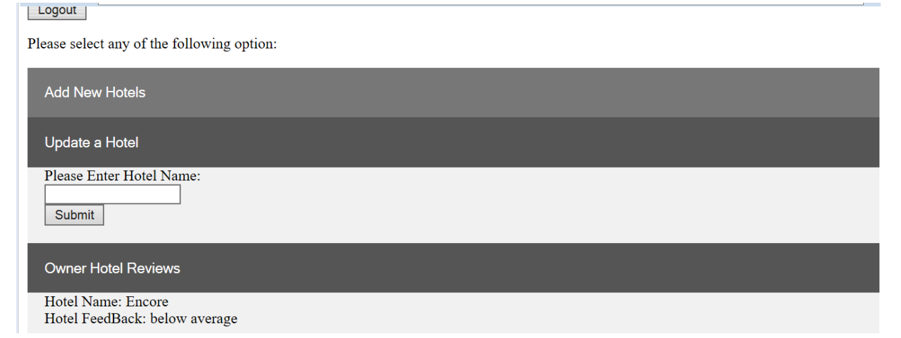

# HotelComparison_SpringMVC
Hotel comparison web application with Java Spring MVC and Hibernate

Summary:
- A hotel comparing system where clients can log in to the website and view a list of accommodation options available to them.
- The Project not only covers Hotels but hostels, resorts and all other types of possible accommodations
- The site provides various property owners to post their advertisement on the website and upload photographs of the property
- The main goal of this project is to provide diverse accommodation options to a client and bridge the gap between the property owners and clients who looking to rent the
property

Users of the application:
- Owner: Can post an advertisement regarding their property for clients to view them
- Client: Can see all the properties posted by the owner and compare all possible accomodation options
- Moderator: Will monitor clients and owners and add category for different types of properties

Functionalities implemented:
- Clients can see the PDF View of all the available hotels
- Email sent to the person registering on the website for the first time (client or owner)
- Bcrypt used for password hashing and making the application more secure
- A property Owner can add its hotels, update them and see the reviews posted by the clients
- Property owner can only update its own listings
- Clients can select various hotel types and select hotels within each type for comparison

Technologies used:
- Spring MVC
- Hibernate
- MySQL
- SQL
- Java EE
- Eclipse
- Apache commons email
- Bcrypt
- PDF viewer

Screenshots:

1) Owner Dashboard:

